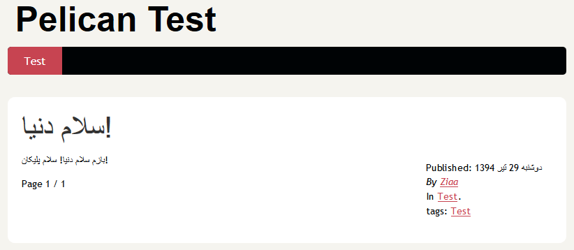
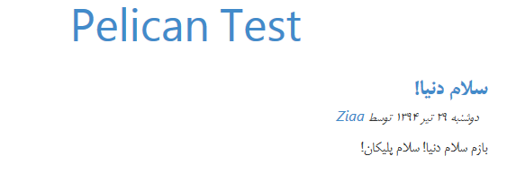

# Pelican Persian date plugin
This is a [Pelican](http://getpelican.com) (Static Site Generator) plugin.

This plugin converts `article.locale_date` attribute
from Gregorian calendar into [Solar Hijri calendar](https://en.wikipedia.org/wiki/Solar_Hijri_calendar) (AKA Jalali calendar, Persian calendar, Iranian calendar) which is the official calendar of Iran and Afghanistan.

## Screenshot
* Output HTML result with Pelican's `notmyidea` theme



* Output HTML result with [Pelican-RTL-theme](https://github.com/ziaa/Pelican-RTL-theme/)


## Installation
1. Get the plugin in any way which is convenient for you. for example:
	* Clone the repository into `plugins` directory
	```
	git clone https://github.com/ziaa/pelican_persian_date.git
	```
	* Or add the repository as a submodule in `plugins` directory
	```
	git submodule add -b master https://github.com/ziaa/pelican_persian_date.git plugins/pelican_persian_date
	```
2. Activate the plugin in your `pelicanconf.py` setting file
(more information on using pelican plugins [+](http://docs.getpelican.com/en/latest/plugins.html#how-to-use-plugins)
[+](https://github.com/getpelican/pelican-plugins#how-to-use-plugins))

  ```
  # Plugins
  PLUGIN_PATHS = ['path/to/plugins']
  PLUGINS = ["pelican_persian_date"]
  ```

3. Define date format in `pelicanconf.py` ([more information on format codes](https://docs.python.org/3.4/library/datetime.html?highlight=datetime#strftime-and-strptime-behavior))
```
DATE_FORMATS = {
    'fa': '%A %d %B %Y'
}
```

## Requirement & testing environment
I'm using this plugin on **Windows** with **Python v3.4.3** & **Pelican v3.6.0** installed.
Perhaps it will work on other platforms & versions.
